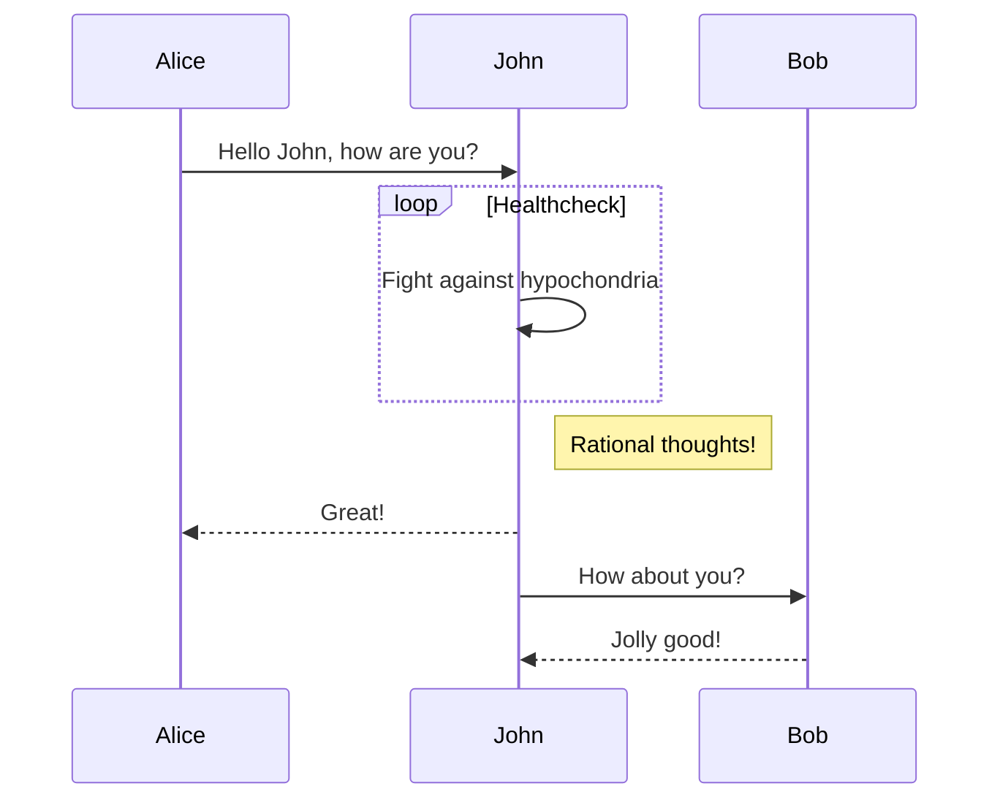

# mermaid 绘图

[toc]

## 插件

- 安装`Markdown Preview Mermaid Support` 插件 , 就可以在 VScode 的默认预览中查看渲染结果

## 时序图

```mermaid
sequenceDiagram

Alice->>John: Hello John, how are you?
loop Healthcheck
John->>John: Fight against hypochondria
end
Note right of John: Rational thoughts!
John-->>Alice: Great!
John->>Bob : How about you?
Bob-->>John : Jolly good!
```
