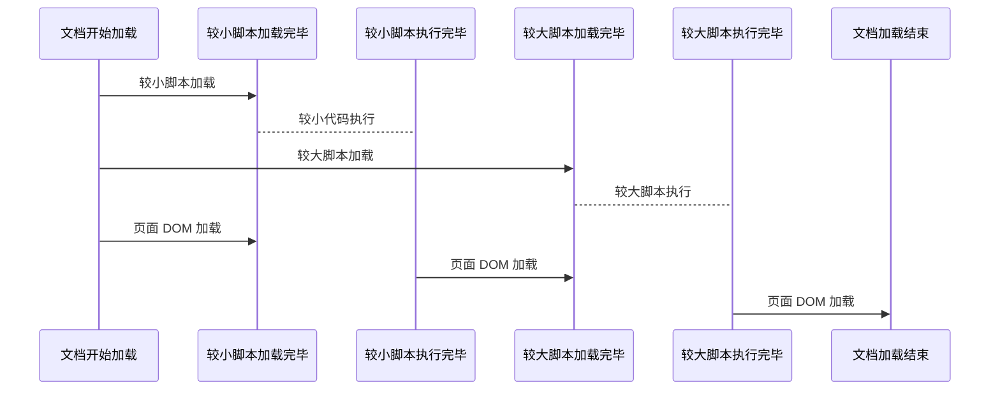
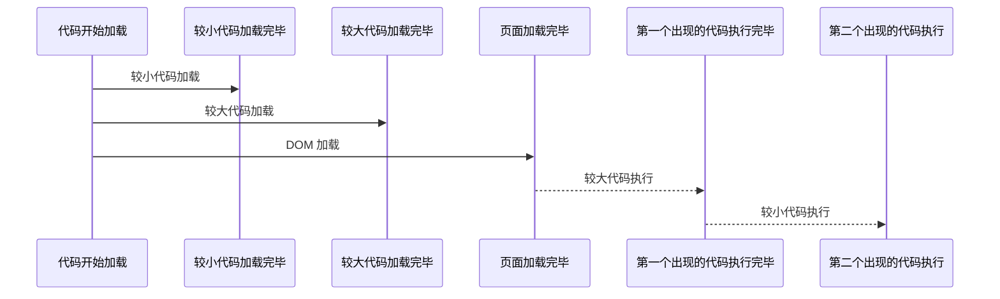

# 使用 javascript

## 通过 `<script>` 标签使用 JavaScript 程序

```html
<body>
  <!-- 页面内容 -->
  <script>
    function hello(){
      alert("hi");
    }
  </script>
</body>
<body>
  <!-- 页面内容 -->
  <script src="hello.js"> </script>
</body>
```

## `<script>` 的常用属性

- `src` 执行外部的脚本文件
- `async` 代码的加载不会影响页面的加载 , 代码加载完毕之后也不会等待其他脚本文件, 会直接运行(运行过程中是阻塞页面加载的)
- `defer` 代码加载不会影响页面的加载 , 页面加载完毕后再开始按照顺序执行代码
- `type` HTML4 标准下用来代替`language`属性的 , 一般填写`text/javascript` 即可 , 现代 JavaScript 已经完全修改了其含义 , 用于**模块**

## src 引用外部 JavaScript 文件

- 被引用的文件会被存储在浏览器缓存中
- 如果多个页面引用相同的`.js` 文件, 会直接从缓存中读取
- 可以节省流量并使浏览器加载更快
- 拥有`src=` 属性的`<script>`脚本会忽略内部的 JavaScript 代码

## 异步代码

```html
<body>
 <script src="相对较大的文件.js"></script>
 <script src="相对较小的文件.js"></script>
  <!-- 页面内容 -->
</body>
```

- async属性添加之后代码的执行顺序如下



- 代码执行的时候依旧**会阻塞页面的加载**
- 代码执行的时候并不会等待其他脚本加载完成
- 所以使用`async` 属性的脚本尽量不做任何`DOM` 处理 ,不要与其他的脚本有联系

## 延时脚本

- 给`<script>` 标签添加`defer`属性可以使所有的脚本加载不阻塞页面的加载 ,
- 脚本加载完毕之后不会立即执行 , 会等到页面加载完毕之后, 按照出现的顺序执行

```html
<body>
 <script src="相对较大的文件.js"></script>
 <script src="相对较小的文件.js"></script>
  <!-- 页面内容 -->
</body>
```



> 不过不是所有的浏览器都能够正确的处理 `defer`  , 遇到问题时可以将`defer`的`<script>` 标签也放在`<body>`的最后

## 禁用 script 后显示的内容

- `<noscript> </noscript>` 标签对内可以包含除了`<script>` 之外的所有标签
- 默认不会显示 , 如果当前浏览器的 javascript 被禁用 , 就会显示出来

```html
<html>
  <head>
    <title>Document</title>
  </head>
  <body>
    <p>常规显示的内容</p>
    <noscript>
      <strong>请解除 javascript 禁用后继续使用</strong>
    </noscript>
  </body>
</html>
```

> 但是如果 javascript 脚本已经执行完毕 , 再禁用页面的 javascript 脚本 , `<noscript>` 也不会显示

## 现代/严格 模式的 JavaScript

- 在代码的开头添加 `"use strict";` 或 `'use strict';`打开严格模式
- `"use strict";` 必须作为代码文档的第一行 , 只有注释可以在它上面 , 否则`"use strict";`不会生效
- 在`class`和`module` 中的代码都会默认打开 严格模式 , 不需要额外的添加`use strict`
